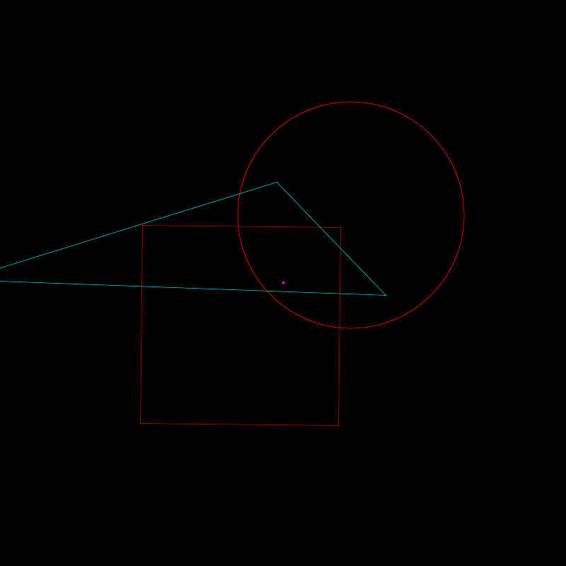

# Minimal GJK Algorithm
This repo holds a minimal GJK algorithm, which is a simple 2D case and no multiple collision detection. It aims to give easy to understand code 
for people interested in the GJK algorithm.

The demo is animated using Taichi gui, which I am familiar to and may further use it to build more complex demos.
- Shapes are white when no collision, red when collision
- The final simplex is blue
- The origin is drawed in pink

Please refer to the great article [Gilbert-Johnson-Keerthi Distance Algorithm (cse442-17f.github.io)](https://cse442-17f.github.io/Gilbert-Johnson-Keerthi-Distance-Algorithm/)
